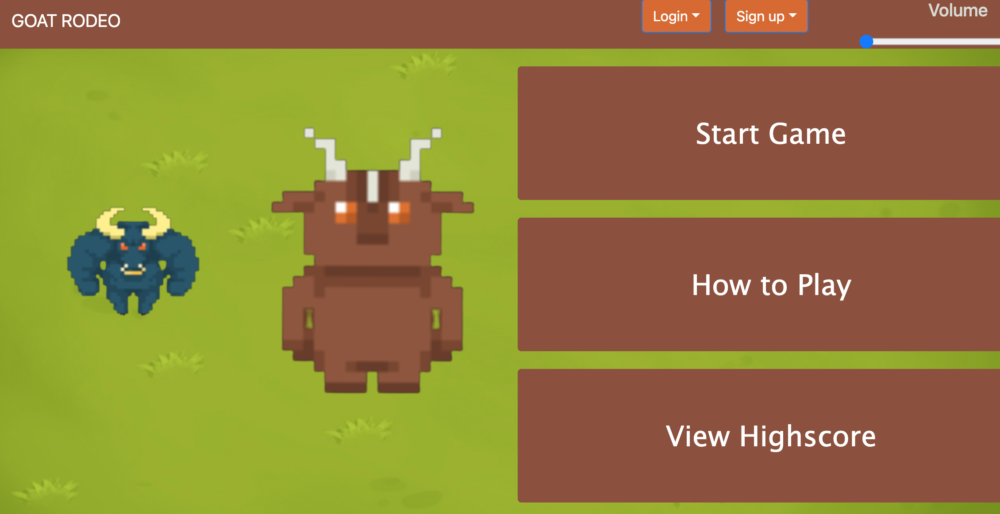
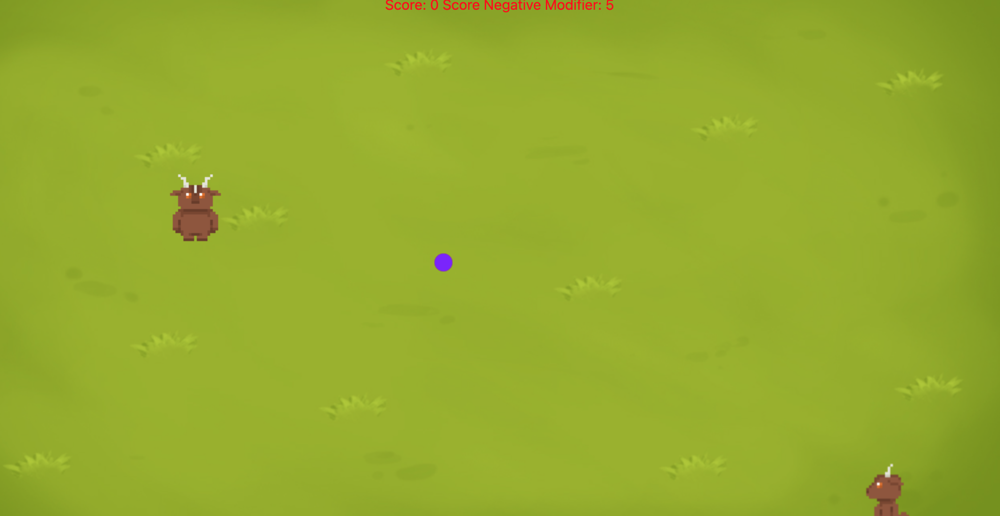

# GOAT RODEO 🐐
### License

## Demo ⚠️
[Here is a demo of it in action!](https://courtsandrevival.herokuapp.com/game) 

## Description
Have you ever been bored? The answer is probably yes! Well worry not, with Goat Rodeo you will never have to worry about boredom again. (We are not liable for any excessive play). Goat Rodeo is a game that is simple and fun to play. This application is a one person game. Users begin the game and their goal is to hit as many opponents as they can with their dodgeball. The more opponents they manage to hit, the more points they earn. Players can login to view their game history.

## Instructions 📝
Click on the link above to access this game application. Users land on the home page. 

Users can sign in or log in to track and view score their score history. Players can also decide to not sign in to play. 

How To Play

Move: Arrow keys [up, down, left right]
Shoot: Spacebar

Rules

Positive Score: Shoot a goat, score a point!
Negative Score: If an enemy makes it past you, their score increases by 5!

Win/Lose Condition

A certain colorful orb may be key for achieving a high score.
Play until the enemy team score is higher than yours.
Remember, their score increases by 5 each time they score - so keep up!

# Team ✨

Thanks goes to these wonderful people 
<table>
  <tr>
<td align="center"><a href="https://github.com/aaronhdm"> <b>Aaron Hernandez </b></a></td>
<td align="center"><a href="https://github.com/DEAD-STOP"> <b>Austin Stoppenhagen </b></a></td>
<td align="center"><a href="https://github.com/bralvis2"> <b>Brenda Alvis</b></a></td>
<td align="center"><a href="https://github.com/Dusticcus"> <b> Dustin Safady</b></a></td>
 </tr>
</table>
